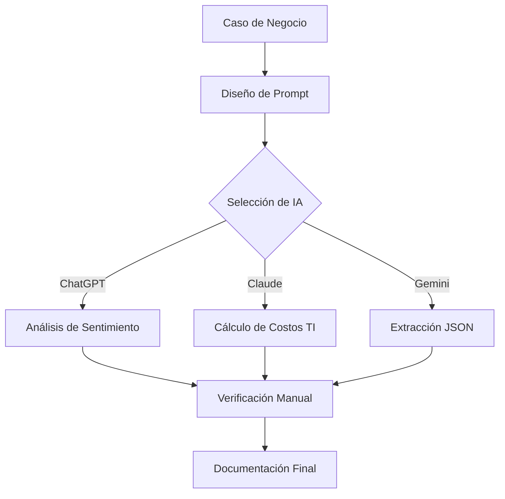

# Evaluación 02: Ingeniería de Prompts e Integración de IA

Documentación del desarrollo de los casos prácticos aplicando ChatGPT, Claude y Gemini.

## 📑 Tabla de Contenidos
1. Pregunta 1: Análisis de Sentimiento con ChatGPT
2. Pregunta 2: Optimización de Costos TI con Claude
3. Pregunta 3: Extracción JSON con Gemini
4. Diagrama de Flujo del Trabajo
5. Tabla Comparativa y Conclusión

---

## 🟢 Pregunta 1: ChatGPT (Análisis de Sentimientos)
- Clasificación de comentarios de clientes (positivo, negativo, neutro) e identificación de aspectos clave.
- Capturas guardadas en la carpeta /img.

---

## 🟠 Pregunta 2: Claude (Optimización de Costos API EduTech)
- Prompt estructurado en bloques XML (`<contexto>`, `<datos>`, `<tarea>`).
- Resultados:
  * Costo Escenario Actual: US$ 972 / mes
  * Costo Escenario Optimizado: US$ 792 / mes
  * Ahorro logrado: 18.52% (Cumple el presupuesto de US$ 900).

---

## 🔵 Pregunta 3: Gemini (Extracción JSON)
- Técnica: Few-shot Prompting con esquema JSON estricto.
- Validación: Conversión exitosa de texto ("año y medio" -> 1.5) y uso correcto de valores null.

---

## 🔄 Flujo de Trabajo (Diagrama Mermaid)

## 📊 Tabla Comparativa de IAs
| Criterio | ChatGPT | Claude 3.5 Sonnet | Gemini |
| :--- | :--- | :--- | :--- |
| Fortaleza | Procesamiento de texto libre | Razonamiento matemático y XML | Estructuración estricta de JSON |
| Técnica Usada | Zero-shot | Bloques XML | Few-shot Prompting |
| Precisión | Alta | Exacta (100%) | Alta |
Conclusión: Cada modelo de IA demostró ser eficaz según la tarea. Claude destacó en precisión financiera con lógica XML, ChatGPT en análisis sintáctico y Gemini en la extracción limpia de datos estructurados en formato JSON.
